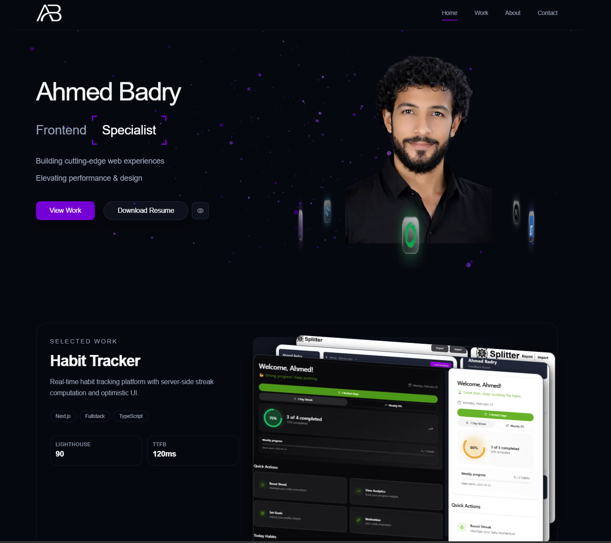
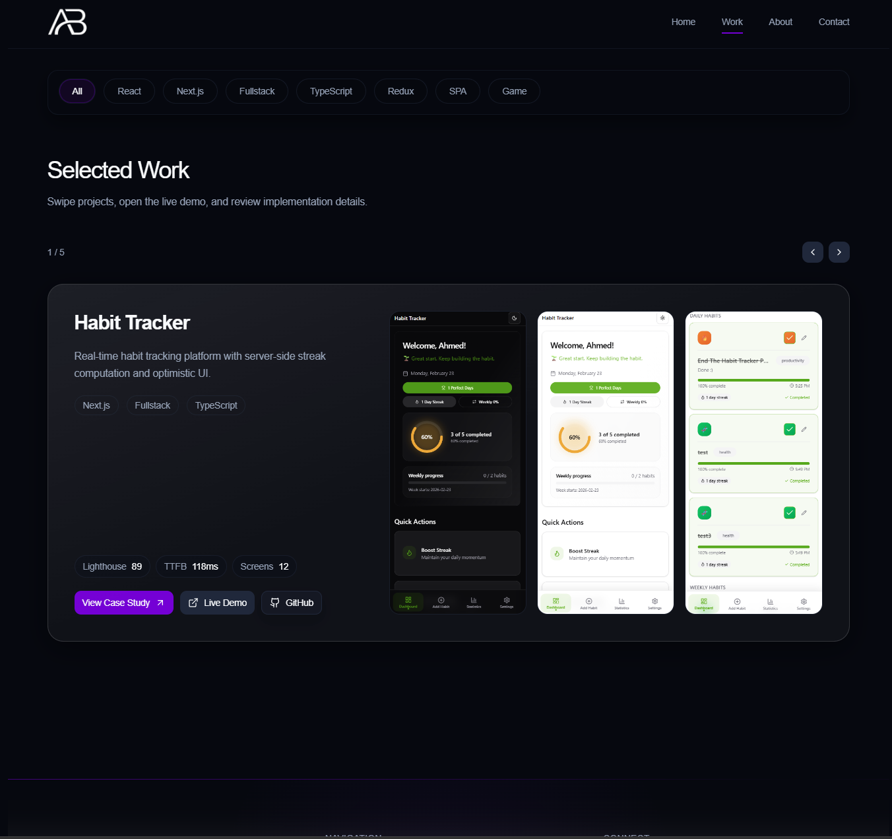
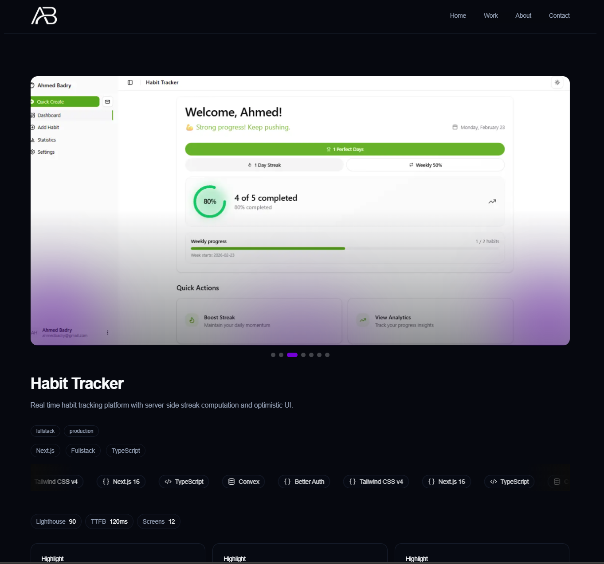
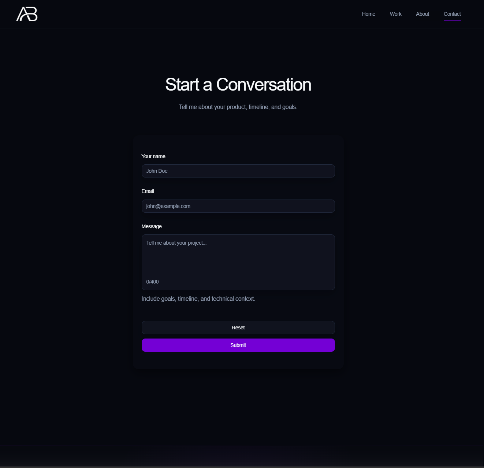

<!-- ========================================================= -->

<!--                 AB.dev — Portfolio README                 -->

<!-- ========================================================= -->

<h1 align="center">
🚀 AB.dev — Frontend Engineering Portfolio
</h1>

<p align="center">

<strong>
Production-grade frontend engineering • Performance-first UI • Case-study driven storytelling
</strong>

</p>

<p align="center">

⚡ Next.js App Router   •   🔷 TypeScript   •   🎨 Tailwind CSS   •   🎬 Motion Systems

</p>

---

## 🌍 Live Demo

👉 https://<your-portfolio-domain>

---

# 🖼️ Website Preview

---

## 🏠 Home — Hero Experience

<p align="center">



</p>

---

## 💼 Work / Projects

<p align="center">



</p>

---

## 📚 Case Study Example

<p align="center">



</p>

---

## 📬 Contact Experience

<p align="center">



</p>

---

# 📖 About The Project

AB.dev is a **production-style frontend engineering portfolio** designed to demonstrate real product thinking — not just UI visuals.

The project focuses on:

✅ Architecture clarity.
✅ UX smoothness.
✅ Performance discipline.
✅ Maintainable feature ownership.

Projects are presented as **engineering case studies**, combining:

- Product context.
- Technical challenges.
- Implementation strategy.
- Outcomes and learnings.

---

# ⭐ Key Features

✅ Dynamic Case Study Routing (`/projects/[slug]`).

🧾 MDX-based long-form storytelling system.

🏗️ Feature-driven architecture modules.

📱 Fully responsive layouts.

---

### 🎬 Advanced Animation Stack

- Framer Motion → interaction transitions.
- GSAP ScrollTrigger → storytelling timelines.
- OGL → shader / canvas visual effects.

---

### 📬 Contact Workflow

- Zod validation.
- React Hook Form integration.
- Email delivery via Resend API.

---

### ♿ Accessibility

- Keyboard navigation.
- Reduced motion handling.
- Semantic HTML structure.

---

### ⚡ Performance

- Next.js Image Optimization.
- Server-first rendering.
- Scoped hydration.

---

# 🧰 Tech Stack

| ⚙️ Technology      | Purpose                 |
| ------------------ | ----------------------- |
| ⚡ Next.js 16      | App Router + API Routes |
| ⚛️ React 19        | Component Composition   |
| 🔷 TypeScript      | Type Safety             |
| 🎨 Tailwind CSS v4 | Styling Tokens          |
| 🧩 shadcn/ui       | Component Primitives    |
| 🧾 MDX             | Case Study Content      |
| 📨 Resend          | Email Delivery          |
| 🎬 Framer Motion   | UI Motion               |
| 🎞️ GSAP            | Scroll Animation        |
| 🌌 OGL             | WebGL Effects           |
| 🎠 Embla           | Carousel Engine         |

---

# 🏗️ Architecture Overview

### Rendering Model

- Server Components by default.
- `"use client"` only where interaction exists.
- Services shape data before rendering.

---

## 🔄 Request Flow

```text
User Request
      ↓
App Router (Server)
      ↓
Service Layer
      ↓
Repository Layer
      ↓
Typed Data / MDX Content
```

---

## 🧭 Routing Structure

```text
app
├─ layout.tsx
├─ api/contact/route.ts
├─ about/page.tsx
├─ work/page.tsx
├─ contact/page.tsx
└─ projects/[slug]/page.tsx
```

---

# 📂 Folder Structure

```text
.
├─ app/
├─ features/
├─ components/
├─ content/projects/
├─ services/
├─ repositories/
├─ lib/
├─ convex/
├─ public/
└─ next.config.ts
```

---

# ⚡ Performance Strategy

- Server-first rendering minimizes hydration.
- Static params generation for case studies.
- Responsive images using `next/image`.
- Motion-safe animation handling.

---

# 🎬 Animation Philosophy

Animation layers are separated intentionally:

✨ Framer Motion → UI interaction feedback.
🎞️ GSAP → narrative storytelling timelines.
🌌 OGL → immersive visual moments.

Goal:

> Motion enhances usability — never replaces clarity.

---

# 🔎 SEO Strategy

- Next.js Metadata API.
- Robots configuration.
- Planned sitemap generation.
- Semantic HTML hierarchy.

---

# 🚀 Getting Started

## Requirements

- Node.js 20+
- npm

---

## Installation

```bash
npm install
```

---

## Development

```bash
npm run dev
```

---

## Production Build

```bash
npm run build
npm run start
```

---

## Lint

```bash
npm run lint
```

---

# 🔐 Environment Variables

Create `.env.local`

```bash
NEXT_PUBLIC_APP_URL=http://localhost:3000
CONVEX_URL=
RESEND_API_KEY=
```

Used by:

- `lib/env.ts`
- `app/api/contact/route.ts`

---

# ☁️ Deployment

Recommended:

1. Deploy using Vercel.
2. Configure environment variables.
3. Enable sitemap generation.
4. Configure canonical metadata.

---

# 🧠 Engineering Decisions

Why Next.js?

- Server rendering control.
- Route colocation.
- Unified API routes.

Why TypeScript?

- Safer refactors.
- Strong domain modeling.

Why Feature Architecture?

- Scalability.
- Ownership boundaries.

Why MDX?

- Content separated from UI logic.

---

# 💡 Development Philosophy

- Architecture should scale naturally.
- Performance is default behavior.
- Animations serve UX.
- Maintainability over shortcuts.

---

# 👨‍💻 Author

Ahmed Badry
Frontend Engineer

🐙 GitHub
https://github.com/ahmedbadry-dev

💼 LinkedIn
https://www.linkedin.com/in/ahmedbadry-dev

---

# 🎯 Recruiter Section

## What This Project Demonstrates

✅ Architecture Thinking
Clear separation between routing, services, and features.

⚡ Performance Awareness
Server rendering and optimized delivery.

🎨 UI Craftsmanship
Responsive composition and controlled animation depth.

---

<p align="center">

⭐ If you enjoyed exploring this project — feel free to connect or reach out.

</p>

<!-- ========================================================= -->

<!--                END README                                 -->

<!-- ========================================================= -->
